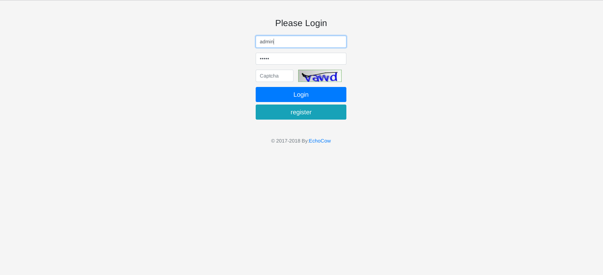
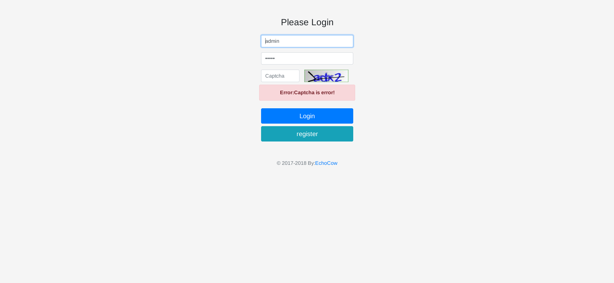
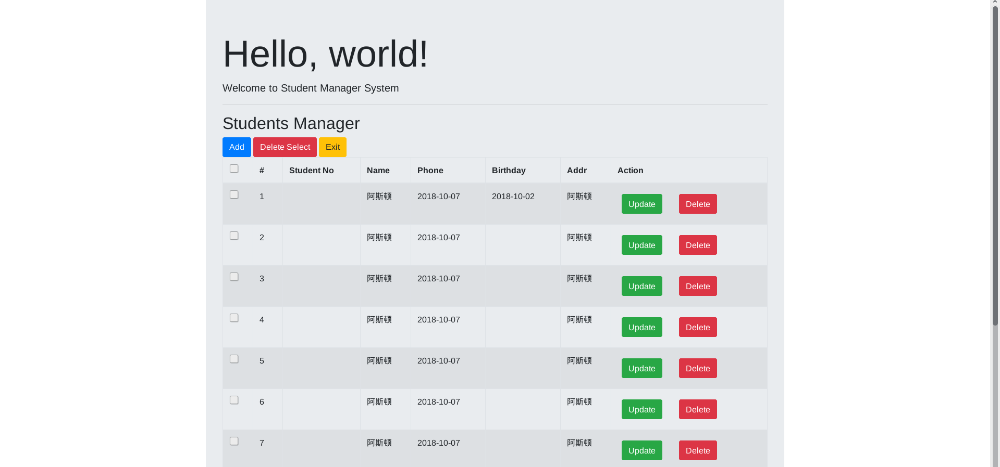
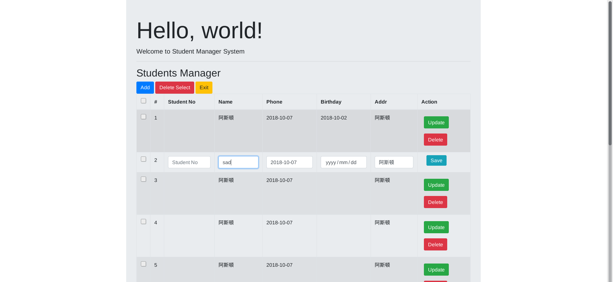
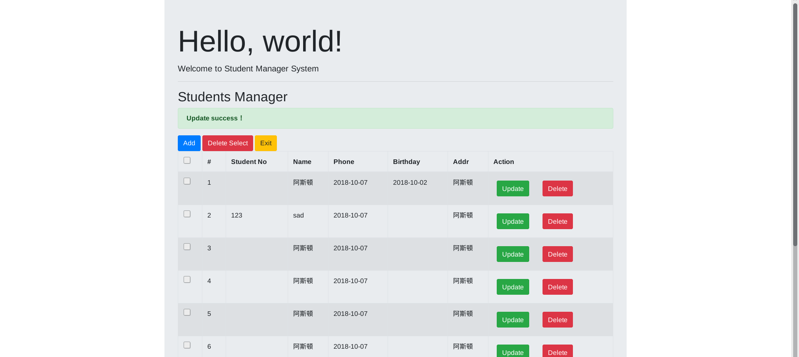

# 基于 spring boot + thymeleaf + jpa 增删改查登录注册demo

前段时间一直在看 spring boot，但是一直没有动手去实战。这段时间才有时间，正好趁着学校
需要交一个 java 增删改查登录注册 的实例，原要求要使用 servlet + jsp 来做，但是因为
自己以前写 servlet 挺多了，如果不去看源码再写进步应该不大，所以想着使用以前一直想学的
spring boot 做一套，所以才有了这个 demo。

一开始打算使用前后段分离,前端用 nginx 反向代理静态页面，然后使用 redis 存储 session，
后端就是 spring-boot 提供 RestFul 风格提供 API 调用即可。但是最近事情真的多，所以做
了一个 "阉割版" 的，前后端半分离，为什么叫做半分离呢？因为我初始化页面还是使用了模板引擎
但是请求的时候依旧使用 ajax 调用 api 接口动态生成页面元素，不过前端依旧没有脱离后端独立
部署运行。

# 技术选型

- 开发工具： IntelliJ IDEA
- 核心框架： spring-boot
- 模板引擎： thymeleaf
- 构建工具： maven 3.3.9
- 构建插件： mvnw
- 数据库： mysql
- 持久层： spring-data-jpa
- 验证码： kaptcha
- 缓存： redis
- 前端： jquery3 + bootstrap4 + bootbox4

# 使用

1. 在你的 IDE 中导入项目，然后使用 maven 导入依赖，如果 maven 版本相差过大导致程序不能正常
运行，可以使用 mvnw 插件自动下载符合的 maven 版本，windows 请运行 `mvnw.cmd`，linux 或 
mac 请运行 `mvnw`

2. 配置文件见 `src/main/resources/application.yml`，修改自己的数据库链接和 redis 链接，
**如果链接信息填写正确，数据库会自动建表，无需导入 sql。**

3. 然后运行 `src/main/java/cn/echocow/web/WebApplication.java` 即可

# 运行简述

## 登录注册

1. 入口处进入 `/index` 即 `MainController` 的 `index` 方法, 判断是否登录，没有登录就不
设置任何东西直接跳转到 `index.html`, 使用 thymeleaf 判断有用户，没有就显示登录注册按钮。

2. 点击登录， `/login` 即 `MainController` 的 `login` 方法，直接跳转到登录页面 `login.html`,
同时图形验证码请求 `/captcha` 即 `UtilController` 获取验证码图片。填写完成后使用 form 表单直接
POST 提交到 `/login` 即 `MainController` 的 `postLogin` 方法，在里面进行验证登录。

    - 如果登录失败，携带 `msg` 返回页面，同时前端模板引擎判断 `msg` 是否显示并提示。
    - 如果登录成功直接跳转
    
3. 登录成功后，又跳转 `1` 中的 `/index` 即 `MainController` 的 `index` 方法，由于登录了，
所以请求后端数据，然后携带后端数据返回 `index.html` 页面，前端模板引擎判断然后显示列表。登录流
程即跑通了，注册、退出都是同理。

## 增删改查简述

在增删改查中

- 增、查使用的是 模板引擎
- 删、改使用的是 ajax 提交，然后用 jq 控制元素的显示与删除

为什么这么做？

不管嘛。。。反正我喜欢。。。就像前面说的，一开始想前后端分离，但是又涉及到了认证、授权、跨域一堆问题，
然后又没时间，所以决定用模板引擎，为啥后面又用 ajax 了呢。。。因为要跳转页面实在不想让他有那么多跳转，
写多了 ajax 后真的会有依赖，异步真的是个好东西，可能这就是我为啥会喜欢 vert.x 的原因吧。

## 其他简述

- config 配置类，其中配置了登录拦截器、验证码生成
- controller 控制器，里面包含拦截器和 api
- entity 实体类，包括了统一响应
- repository jpa、crud 接口实现
- service 服务提供

# 总结

感觉比起来还是比较喜欢 vert.x 前面写了个基于 vert.x 的易班应用 [易运动](https://github.com/GZMZ-YIBAN/YBSport-vertx)
,感觉还是喜欢那种开发方式。不过真的，spring 的生态链实在太强大，基本上我遇到的问题网上都能够找到完美的
解决方案，虽然质量参差不齐，但是总归比 vert.x 一搜不到一页来得爽太多。

无 xml 配置简直让我爱不释手，注解基本解决了大多问题，不论是 servlet 3.1 还是 servlet 4.0 都感觉没
有 spring boot 来得爽，果然 java EE 后端被 spring 系列占有大部分市场是有原因的。

期末的时候打算使用 vue + spring boot 做个后台管理系统，如果有时间会引入第三方登录，一直很想做的一个
东西。这段时间太忙，只能匆匆做一个交给老师了，质量不是很高，很多东西没有做，比如全局异常捕获都没做。。。

[Github](https://github.com/lizhongyue248)

© 2017-2018 By: [EchoCow](https://www.echocow.cn)

# 截图

